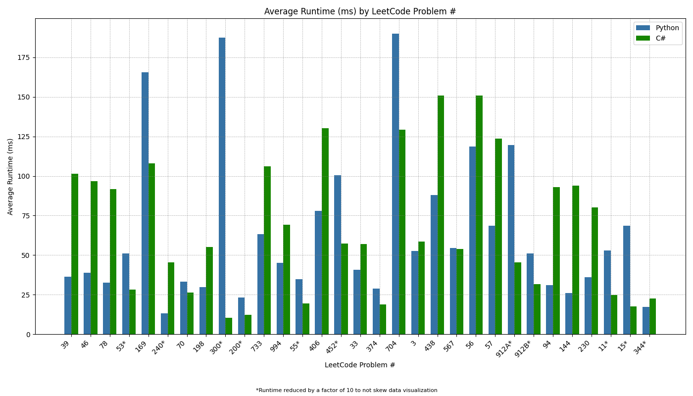
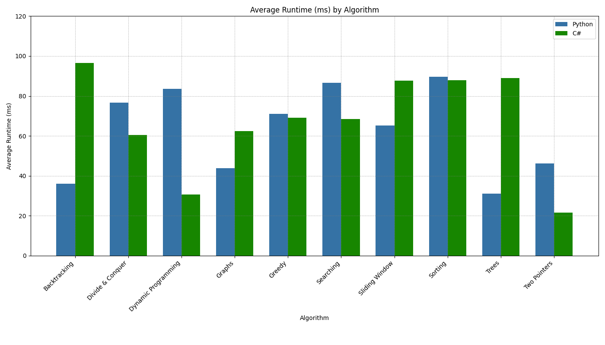
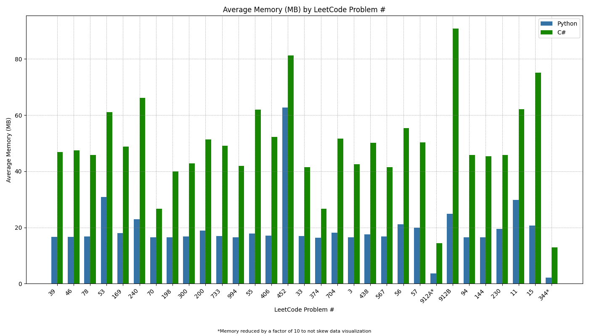
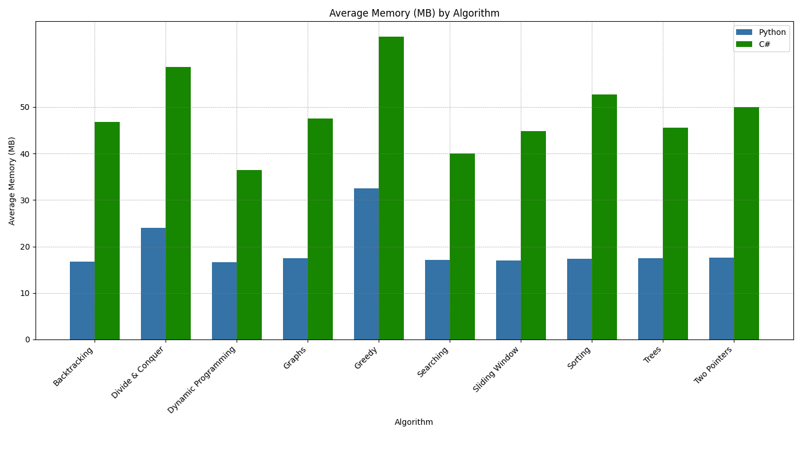

# Analyzing Python and C# Performance in LeetCode Problems

## Premise

This repository serves as the second entry in my 3 part series comparing Python's LeetCode performance to that of C++, C#, and C. Since this is a didactic project with a focus on C# syntax, the solutions in C# contain additional lines of code not found in the Python solutions. These additional lines of code were not part of the submitted solutions.

If you would like to skip to the comparative charts, [click here](#charts).

## Method

To make the comparison concrete, I first selected 10 different algorithmic problem sets featured on LeetCode. From these sets, I chose 3 representative problems.

For each problem, I developed a solution in Python and then translated that solution into C# (with one exception that I'll touch on later). I aimed to keep the logic and structure as similar as possible between the two languages to allow for a fair comparison.

The exception case I mentioned earlier was LeetCode problem 912, which was part of the selections focusing on sorting algorithms. Given that there is a built-in method that can reduce an otherwise lengthy solution down to a couple lines of code in both languages, I felt both approaches merited inclusion.

Once I was satisfied with the solutions, I submitted each solution three times in the LeetCode sandbox to procure a broader dataset. I recorded the runtime (in milliseconds) and memory usage (in megabytes) for each submission, then averaged those values to obtain a single runtime and memory figure for each problem. After that, I averaged the mean values for each problem to get an average runtime and memory figure for each algorithm. The runtime and memory figures for each problem and algorithm served as the cornerstones of this performance comparison.

Before getting to the results, I want to acknowledge that LeetCode is not the ideal way to test the efficacy of each language’s solutions. Both runtime and memory readings can be skewed by the quality of the user’s machine or by the number of users on the LeetCode platform at the time of testing. However, given the prevalence of LeetCode style coding challenges in competitive programming, it was a logical choice to streamline performance testing.

## Results

I was very surprised to see how similar the runtimes were between the Python and C# solutions. What was even more unexpected was that the data clearly shows Python being **faster** on average than C#. I initially thought that perhaps my C# solutions were simply not in the same performance percentile as my Python solutions, but there is no meaningful discrepancy in that metric.

For example, let's compare the solutions in both languages to problem 33 in the Searching algorithm set:

LC 33 Comparison

Python:
 

- Runtime1: 43ms, beats 57.45%
- Runtime2: 37ms, beats 89.99%
- Runtime3: 42ms, beats 67.07%
 

- Memory1: 41.32MB, beats 56.41%
- Memory2: 41.40MB, beats 56.41%
- Memory3: 41.76MB, beats 11.19%
 

C#:
 

- Runtime1: 59ms, beats 82.78%
- Runtime2: 59ms, beats 82.78%
- Runtime3: 53ms, beats 96.23%
 

- Memory1: 16.83MB, beats 73.04%
- Memory2: 16.88MB, beats 72.42%
- Memory3: 16.95MB, beats 33.05%

As you can see, the runtimes for C# scored significantly higher than those of Python relatively speaking. However, even the runtime that beat over 96% of other C# solutions was still 10ms slower than the Python solution that only beat 57% of other Python solutions.

The memory usage for this problem tells a simliar story. Even though the C# solutions scored lower in their performance percentile, the solution that beat 11% of other C# solutions used only 0.36MB more memory than the solution that beat 56%. This suggests that there is not much deviation across the entire range of memory usage for this problem's C# solutions.

Additonally, the Python solution that beat 33% of other Python solutions in memory usage used only 0.12MB more than the solution that beat 73%. This confirms that there is not much deviation across the entire range of memory usage for this problem's Python solutions either.

Based on the above insights, I would say to take the runtime and memory comparisons below with a fairly large grain of salt.

Runtime Comparison

* Backtracking - Python was 2.682x faster
* Divide & Conquer - C# was 1.267x faster
* Dynamic Programming - C# was 2.723x faster
* Graphs - Python was 1.427x faster
* Greedy - C# was 1.023x faster
* Searching - C# was 1.265x faster
* Sliding Window - Python was 1.348x faster
* Sorting - C# was 1.019x faster
* Trees - Python was 2.871x faster
* Two Pointers - C# was 2.142x faster
 

* Python average runtime – 62.945ms
* C# average runtime – 67.388ms
 

* Overall average – Python was 1.071x (7.1%) faster

Memory Comparison

* Backtracking – Python used 30.018 fewer MB
* Divide & Conquer – Python used 34.689 fewer MB
* Dynamic Programming – Python used 19.869 fewer MB
* Graphs – Python used 29.987 fewer MB
* Greedy – Python used 32.633 fewer MB
* Searching – Python used 22.837 fewer MB
* Sliding Window – Python used 27.817 fewer MB
* Sorting – Python used 35.309 fewer MB
* Trees – Python used 28.071 fewer MB
* Two Pointers – Python used 32.475 fewer MB
 

* Python average memory usage – 19.39MB
* C# average memory usage – 48.76MB
 

* Overall average – Python used 29.37 fewer MB

## Average Runtime (ms) by LeetCode Problem #

## Average Runtime (ms) by Algorithm

## Average Memory (MB) by LeetCode Problem #

## Average Memory (MB) by Algorithm
